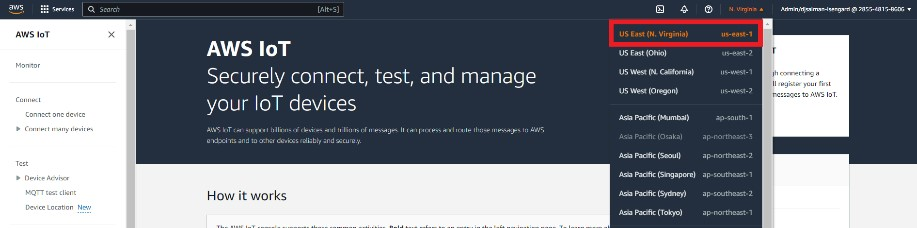
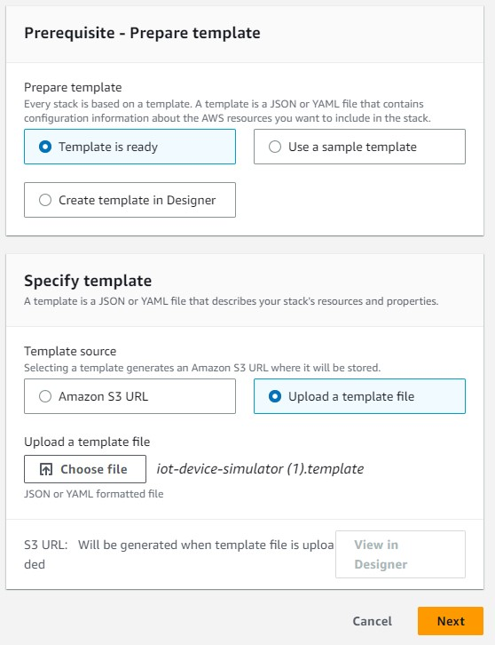
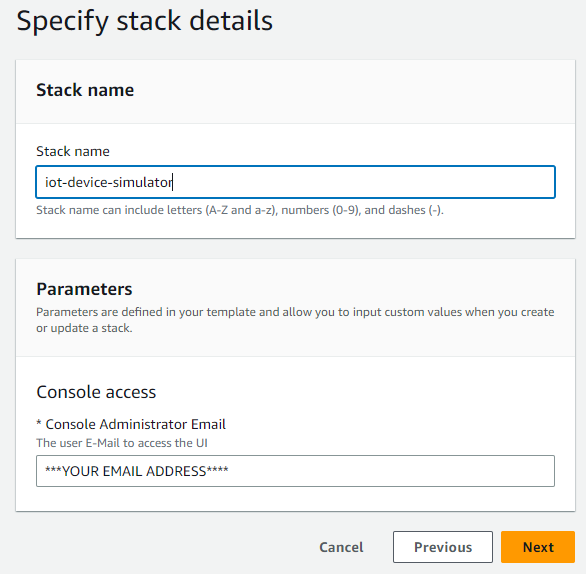
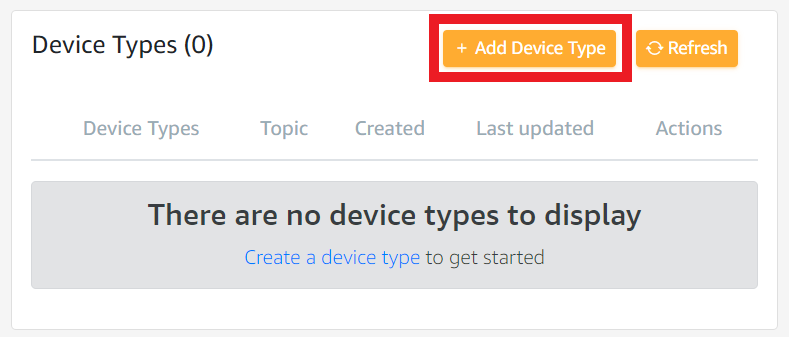
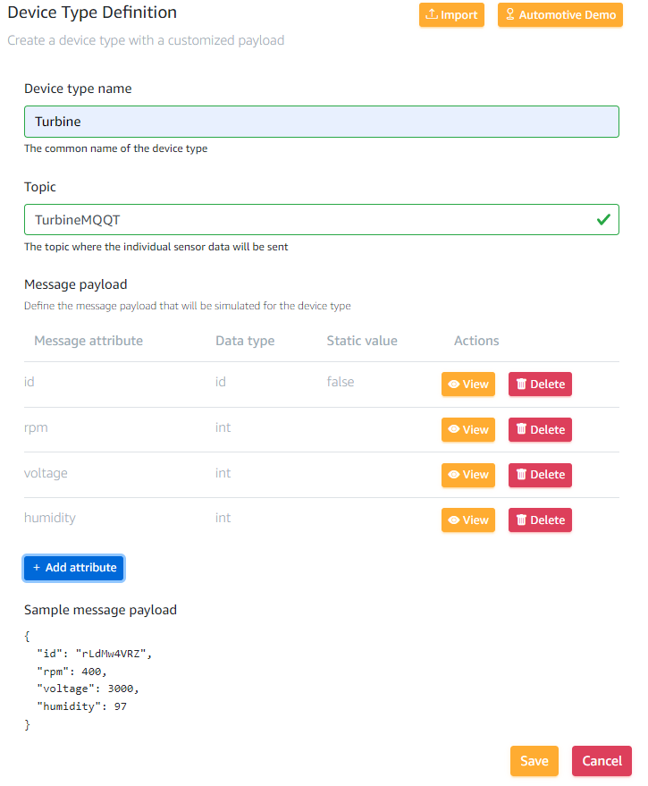
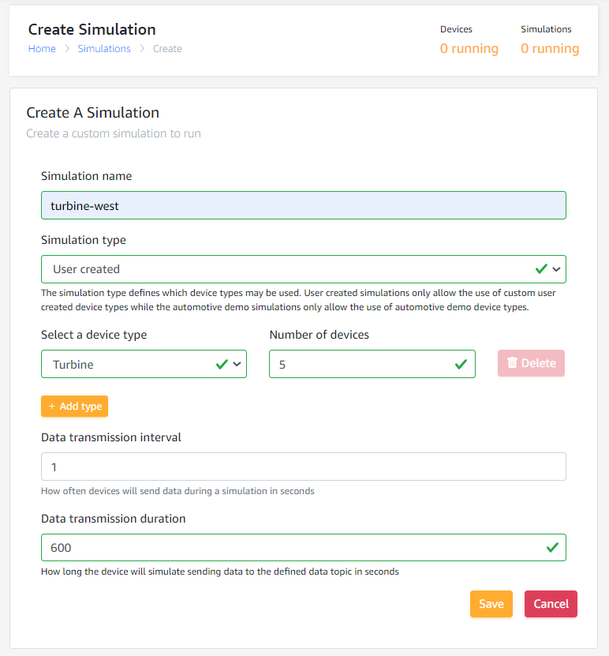
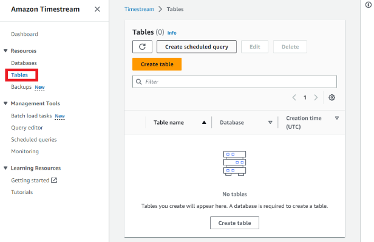
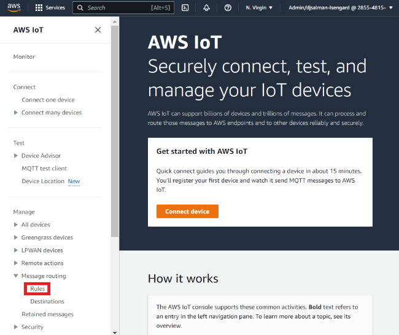
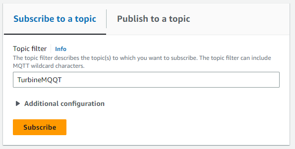
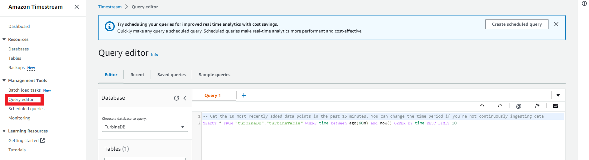

# Simulating IoT data into Timestream

In 2022 the number of connected IoT devise grew to [_14.4
billion_](https://iot-analytics.com/number-connected-iot-devices/). This
number is expected to grow exponentially alongside the jobs in this
field. In 2022 global consulting firm McKinsey & Company found the
biggest barrier to IoT adoption was skill shortages in the workforce.
The number of jobs openings is outpacing the supply of IoT engineers.
One of the main barriers to learning about IoT is the cost associated
with purchasing IoT hardware.

This blog shows how you can simulate IoT devices and capture/filter that
data for your own visualization tools. In 30 minutes you will learn how to

- Use a
  [**_CloudFormation_**](https://docs.aws.amazon.com/cloudformation/index.html)
  template to create iot device simulator

- Capture time series data from the simulator into [**_AWS IoT
  Core_**](https://docs.aws.amazon.com/iot/index.html)

- You will send that data into [**_Amazon
  Timestream_**](https://docs.aws.amazon.com/timestream/index.html)
  for your visualization

**_Prerequisites_**

- An AWS Account

- An understanding of the associated costs of this demo:
  [_Here_](https://docs.aws.amazon.com/solutions/latest/iot-device-simulator/cost.html)

**_Instructions_**

1.  Familiarize yourself with an AWS [CloudFormation
    template](https://aws.amazon.com/cloudformation/resources/templates/)

2.  Download the cloudformation template [_here_](https://s3.amazonaws.com/solutions-reference/iot-device-simulator/latest/iot-device-simulator.template)

3.  Open your AWS console (click
    [_here_](https://us-east-1.console.aws.amazon.com/console/home?region=us-east-1))

4.  At the top right make sure the **_N. Virginia_** region (us-east-1) is selected

    

5.  At the top left of the console search for and click on CloudFormation ([_or click here_](https://us-east-1.console.aws.amazon.com/cloudformation/home?region=us-east-1#/stacks?filteringText=&filteringStatus=active&viewNested=true))

6.  On the top right click the orange **_Create Stack_** button.

7.  In the section titled **Prerequisite – Prepare Template** select the **_Template is ready_** button

8.  In the section below titled **Specify Template** select **Upload a template file**

9.  Upload the file you downloaded earlier click **Next.**

    

10. On the next page, under the section title **Stack name** enter
    **iot-device-simulator**

11. Under the section title **Parameters** enter your personal email
    address and hit **_Next_**

    

12. Hit **_Next_** then **_Next_** again

13. Check the box at the bottom of the page next to **I acknowledge that
    AWS CloudFormation might create IAM resources** and hit **_Submit_**

14. Wait about 5 minutes. You will receive an email from
    <no-reply@verificationemail.com> with login information.

15. Click the link and sign in using the credentials provided to you

    

16. At the top of the site click the **_Device Types_**
    button{width="6.491666666666666in"
    height="0.38333333333333336in"}

17. Click the **_+ Add Device Type_** button

     

18. Under Device type name enter **_Device type name_**

19. Under **Topic** enter **_TurbineMQQT _**

20. Under the section title **Message payload** click the **_+ Add
    attribute_** button

21. Add an attribute by clicking the **_+ Add attribute_** button

22. Enter the following values

    > Attribute name: **_id_**
    >
    > Attribute data type: **_ID_**
    >
    > ID character set (optional): (leave blank)
    >
    > ID length (optional): (leave blank)
    >
    > Static: **_False_**

23. Add another attribute by clicking the **_+ Add attribute_** button

    > Attribute name: **_rpm_**
    >
    > Attribute data type: **_Integer_**
    >
    > Minimum Value: **_20_**
    >
    > Maximum Value: **_400_**
    >
    > Default Value: (leave blank)

24. Add one more attribute by clicking the **_+ Add attribute_** button

    > Attribute name: **_voltage_**
    >
    > Attribute data type: **_Integer_**
    >
    > Minimum Value: **_600_**
    >
    > Maximum Value: **_3000_**
    >
    > Default Value: (leave blank)

25. **_(Optional)_** Add one attribute of your choice (Feel free to copy
    the example below or make your own)

    > Attribute name: **_humidity_**
    >
    > Attribute data type: **_Integer_**
    >
    > Minimum Value: **_23_**
    >
    > Maximum Value: **_97_**
    >
    > Default Value: (leave blank)

      

26. Hit the **_Save_** button at the bottom of the page

27. At the top of the page click the **_Simulations_** button

     

28. Click the **_+ Add Simulation_** button

29. Under **Simulation name** enter **_turbine-west_**

30. Under Simulation type choose the **_User created_** option

31. Under **Select a device type** select **_Turbine_**

32. Under **Number of devices** enter your desired number. Remember [the
    _associated
    costs_](https://docs.aws.amazon.com/solutions/latest/iot-device-simulator/cost.html)

33. Under **Data transmission interval** enter **_1_**

34. Under **Data transmission duration** enter your desired duration in
    seconds. I recommend **_600-1200_** but use your discretion based on
    the [_associated
    costs_](https://docs.aws.amazon.com/solutions/latest/iot-device-simulator/cost.html)

35. Click **_Save_**

    

36. Go back to your AWS console and search for Amazon Timestream(or
    click
    [_here_](https://us-east-1.console.aws.amazon.com/timestream/home?region=us-east-1&hashArgs=%23#dashboard))

37. In the left navigation bar click **_Databases_**

    {width="2.1539720034995624in"
    height="1.3576388888888888in"}

38. Click the orange **_Create database_** button

39. Under Choose a configuration select **_Standard database_**

40. Under Name enter **_TurbineDB_**

41. At the bottom click the **_Create Database_** button

42. In the left navigation bar click **_Tables_**

     

43. Click the **_Create table_** button

44. Under **Database name** select **_TurbineDB_**

45. Under **Table name** enter **_TurbineTable_**

46. At the bottom click **_Create table_**

47. In your AWS console and search for IOT Core (or click
    [_here_](https://us-east-1.console.aws.amazon.com/iot/home?region=us-east-1#/home))

48. On the left navigation bar select **Message Routing** then select
    **Rules**

    

49. Click the orange **_Create Rule_** button

50. Under Rule name enter **_allTurbineTelemetryToTimestream_**

51. Add a description if you’d like and click **_Next_**

52. Under **SQL Statement** delete the existing text and enter **_SELECT
    assetId AS id, rpm, voltage FROM 'TurbineMQQT'_**

53. (Optional) if you added a custom attribute on step 25 you can
    include it after **voltage** (don’t forget the comma). If you are
    unsure or unfamiliar with SQL just skip this step.

54. At the bottom click **_Next_**

55. Under **Action 1** search for and click on **_Timestream table _**

56. Under Database name select **_TurbineDB_**

57. Under **Table name** select **TurbineTable**

58. Under **Dimensions Name** enter **_TelemetryAssetType_**

59. Under **Dimension value** enter **_Telemetry_**

60. Click **_Add new dimension_**

61. Under the second **Dimensions name** enter **_TelemetryAssetId_**

62. Under the second **Dimension value** enter **_\${topic(1)}_**

63. Under **Timestamp value – optional** enter **_\${timestamp()}_**

64. Under **Timestamp unit** select **_MILLISECONDS_**

65. Under **IAM role** click **_Create new role_**

66. Enter **_CoreToTimestream_** and click **_Create new role_**

67. Click **_Next_** and then **_Create_**

68. Go back to the Iot Device Simulator URL you received via email

69. At the top of the page click the **_Simulations_** button

    {width="6.5in" height="0.325in"}

70. Click the check box next to **turbine-west** and click the yellow
    **Start Simulation(s)** button

     

71. Return to the AWS IoT in the AWS
    console([_here_](https://us-east-1.console.aws.amazon.com/iot/home?region=us-east-1#/test)).

72. In the left navigation bar click **_MQQT test client_**

    {width="2.7in" height="1.9107688101487315in"}

73. Under **Subscribe to a topic** enter **_TurbineMQQT_**

     

74. You should see your IoT data populating under **Subscriptions.** If
    you don’t see data populating then something was spelled
    incorrectly. Retrace your steps.

75. Congratulations you are in the home stretch all that is left is to
    find your data in Amazon Timestream

76. At the top of the AWS Console search for and click on Amazon
    Timestream

77. On the left navigation click on Query editor

     

78. In the text box under **Query 1** enter **_SELECT \* FROM
    "TurbineDB"."TurbineTable" WHERE time between ago(60m) and now()
    ORDER BY time DESC LIMIT 10_**

79. You should see data populating below.

80. Congratulations. You have completed this workshop.

    - You have simulated MQQT data

    - Sent that data into Iot Core

    - Queried that data into Timestream

81. All that is left is connecting this to a visualization tool like
    Quicksight or Grafana. That out of scope for this workshop but you
    can learn about that
    [**_here_**](https://docs.aws.amazon.com/general/latest/gr/timestream.html).
